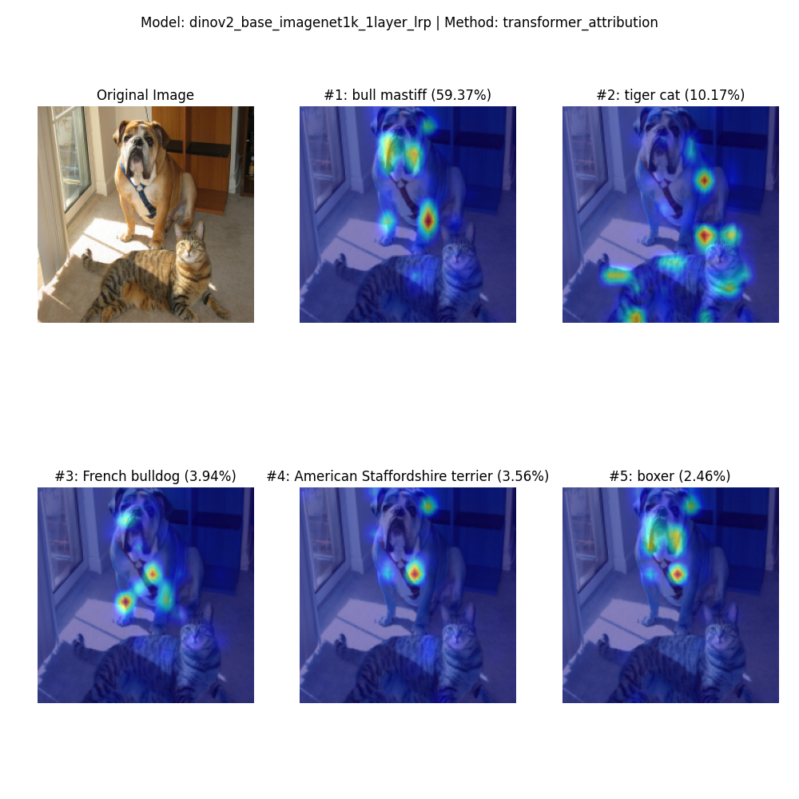

# ViT Explainability with Approximated LRP

An implementation based on [Transformer Interpretability Beyond Attention Visualization](https://arxiv.org/abs/2012.09838) (CVPR 2021).

## Objective

This repository studies the explainability of Vision Transformers (ViTs) trained with different methods:

- **Supervised learning** on ImageNet
- **Self-supervised learning** (e.g., MoCo, DINO, MAE)
- **Vision-language models** (e.g., ViT backbones trained with CLIP)

## Background

There are several approaches for computing heatmaps that reflect explainability (XAI):

| Method | Description |
|--------|-------------|
| [GradCAM](https://arxiv.org/abs/1610.02391) | Primarily designed for CNNs |
| [Attention Rollout](https://arxiv.org/abs/2005.00928) | Aggregates attention across layers |
| [Attention Rollout + Gradients](https://arxiv.org/abs/2012.09838) | Approximated Layer-wise Relevance Propagation (LRP) for Transformers |
| [AttnLRP](https://proceedings.mlr.press/v235/achtibat24a.html) | Exact LRP implementation for ViT |

This implementation uses the **approximated LRP method** by [Hila Chefer](https://github.com/hila-chefer/Transformer-Explainability) due to its simplicity and adaptability across different ViT architectures.

> **Note:** To produce heatmaps, the ViT must have a classification head trained on ImageNet.

## Results

**DINOv2 Base (ImageNet 1K, 1-layer LRP):**

  

**ViT Base Patch16 224:**

  

