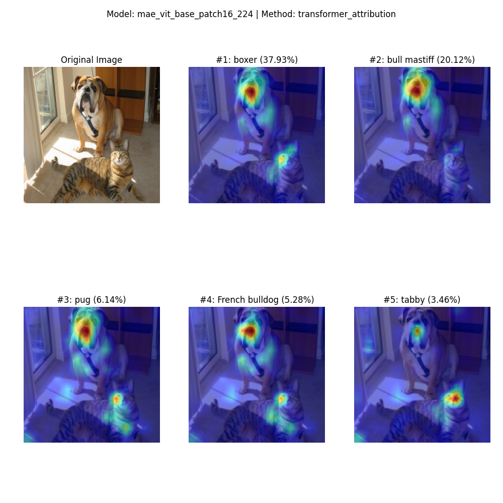
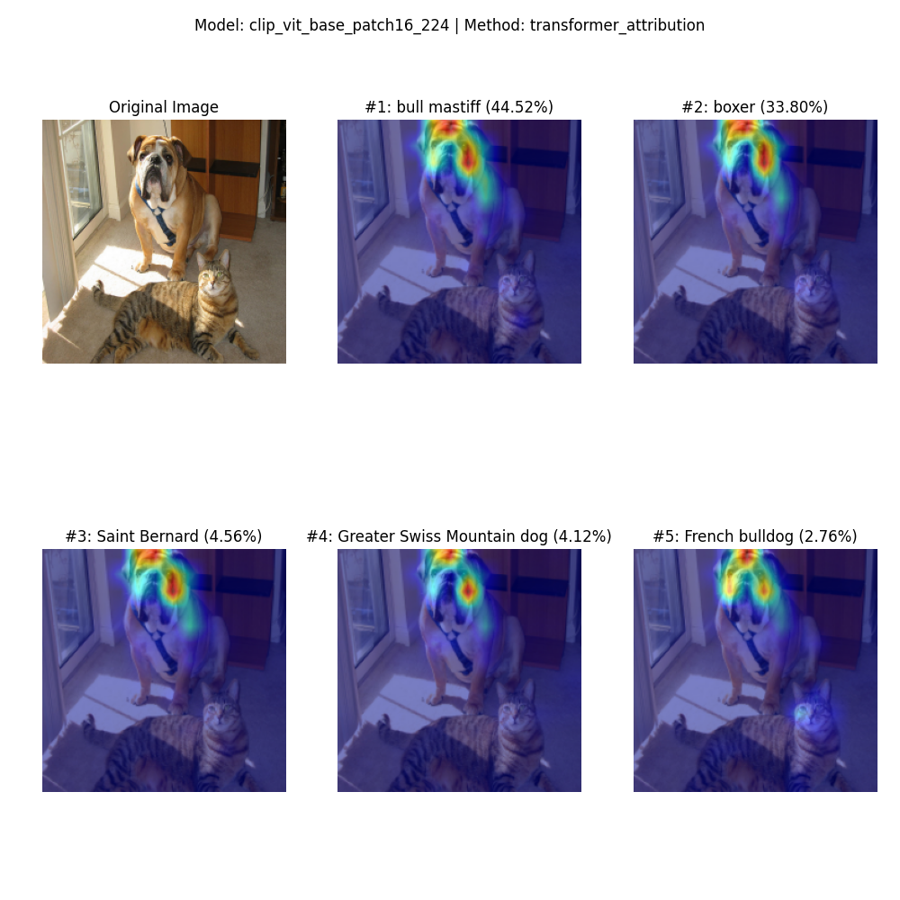

# ViT Explainability with Approximated LRP

An implementation based on [Transformer Interpretability Beyond Attention Visualization](https://arxiv.org/abs/2012.09838) (Chefer et al., CVPR 2021).

## Objective

This repository studies the explainability of Vision Transformers (ViTs) trained with different methods:

- **Supervised learning** on ImageNet (original ViT)
- **Self-supervised learning** (MAE, DINOv2)
- **Vision-language models** (CLIP)

## Background

Several approaches exist for computing heatmaps that reflect model explainability (XAI):

| Method | Description |
|--------|-------------|
| [GradCAM](https://arxiv.org/abs/1610.02391) | Primarily designed for CNNs |
| [Attention Rollout](https://arxiv.org/abs/2005.00928) | Aggregates attention weights across layers |
| [Attention Rollout + Gradients](https://arxiv.org/abs/2012.09838) | Approximated Layer-wise Relevance Propagation (LRP) for Transformers |
| [AttnLRP](https://proceedings.mlr.press/v235/achtibat24a.html) | Exact LRP implementation for ViT |

This implementation uses the **approximated LRP method** from [Hila Chefer's Transformer-Explainability](https://github.com/hila-chefer/Transformer-Explainability) due to its simplicity and adaptability across different ViT architectures.

> **Note:** To produce heatmaps, the ViT must have a classification head. For self-supervised models (MAE, CLIP), linear probing on ImageNet is required first.

## Supported Models

| Model | Pretraining | Head | Classes |
|-------|-------------|------|---------|
| `vit_base_patch16_224` | Supervised (ImageNet) | Linear probe | 1000 |
| `dinov2_base_imagenet1k_1layer_lrp` | DINOv2 self-supervised | Linear probe | 1000 |
| `mae_vit_base_patch16_224` | MAE self-supervised | Linear probe (by me)| 300 |
| `clip_vit_base_patch16_224` | CLIP vision-language | Linear probe (by me) | 300 |

## Contribution

The core Transformer-Explainability code was developed by [Hila Chefer](https://github.com/hila-chefer/Transformer-Explainability). My contributions include:

1. **Adapting the LRP method** to different ViT implementations (DINOv2, MAE, CLIP)
2. **Linear probing** on ImageNet subsets to enable heatmap visualization for self-supervised models
3. **Unified interface** for loading and visualizing different model architectures

## Usage
Python version 3.10.19

```bash
# Install dependencies
uv sync

# Generate heatmap for an image
uv run python main.py --model <model_name> --image <path_to_image> --method transformer_attribution

# Example
uv run python main.py --model mae_vit_base_patch16_224 --image input_images/catdog.png
```

**Available methods:**
- `transformer_attribution` (recommended) - Gradient-weighted attention rollout
- `rollout` - Pure attention rollout (not tested)
- `full` - Full LRP propagation to pixels (not tested)
- `last_layer` - Last layer attention only (not tested)
- `last_layer_attn` - Last layer attention without gradients (not tested)

## Results

**ViT Base Patch16 224 (Supervised):**
<p align="center">
  
</p>

**DINOv2 ViT Base Patch14 224 (Self-supervised + Linear Probe):**
<p align="center">
  
</p>


**MAE ViT Base Patch16 224 (Self-supervised + Linear Probe):**
<p align="center">
  
</p>

**CLIP ViT Base Patch16 224 (Vision-Language + Linear Probe):**
<p align="center">
  
</p>

## Changelog

- **2025-01-22** - Added CLIP ViT-B/16 support (linear probe on ImageNet first 300 classes)
- **2025-01-20** - Added MAE ViT-B/16 support (linear probe on ImageNet first 300 classes)
- **2025-01-16** - Added DINOv2 ViT-B/14 support. Note that the ViT backbone was trained on 518 image size with patch size 14. However, the linear probing was done on ImageNet-1K dataset with 224 inputs.

## References

- Chefer, H., Gur, S., & Wolf, L. (2021). [Transformer Interpretability Beyond Attention Visualization](https://arxiv.org/abs/2012.09838). CVPR 2021.
- Abnar, S., & Zuidema, W. (2020). [Quantifying Attention Flow in Transformers](https://arxiv.org/abs/2005.00928). ACL 2020.
- Achtibat, R., et al. (2024). [AttnLRP: Attention-aware Layer-wise Relevance Propagation](https://proceedings.mlr.press/v235/achtibat24a.html). ICML 2024.
- Jacob Gildenblat's blog post: [Exploring Explainability for Vision Transformers](https://jacobgil.github.io/deeplearning/vision-transformer-explainability)

## Acknowledgments

This work builds upon [Hila Chefer's Transformer-Explainability](https://github.com/hila-chefer/Transformer-Explainability) repository.
